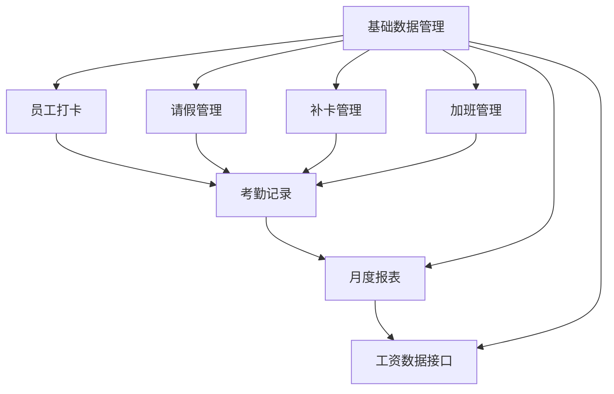

# 业务流程 - 考勤管理系统

> 项目编号: 001-attendance-system
> 创建时间: 2026-06-18
> 对应产物: 05-flow.md
> 范围: P0 + P1 功能（基于 04-prd.md 决策）

---

## 1. 功能依赖 DAG

### 1.1 整体模块依赖



### 1.2 依赖矩阵

| 模块 | 依赖 | 被依赖 |
|------|------|--------|
| 基础数据管理 | - | 员工打卡、请假、补卡、加班、月度报表、工资接口 |
| 员工打卡 | 基础数据 | 考勤记录、月度报表 |
| 请假管理 | 基础数据 | 考勤记录、月度报表 |
| 补卡管理 | 基础数据 | 考勤记录、月度报表 |
| 加班管理 | 基础数据 | 考勤记录、月度报表 |
| 考勤记录 | 员工打卡、请假、补卡、加班 | 月度报表 |
| 月度报表 | 考勤记录、基础数据 | 工资数据接口 |
| 工资数据接口 | 月度报表、基础数据 | - |

### 1.3 构建顺序建议

基于拓扑排序：
1. **第一阶段**（基础设施）: 基础数据管理
2. **第二阶段**（核心业务）: 员工打卡、请假管理、补卡管理、加班管理（4 个并行）
3. **第三阶段**（数据聚合）: 考勤记录
4. **第四阶段**（报表）: 月度报表
5. **第五阶段**（集成）: 工资数据接口

---

## 2. 业务流程详述

### 2.1 员工打卡流程

#### 状态定义

| 状态 | 说明 |
|------|------|
| 未打卡 | 到达打卡时间未打卡 |
| 正常 | 30 分钟内打卡成功 |
| 迟到 | 超时 30 分钟内打卡 |
| 早退 | 提前 30 分钟内打卡 |
| 缺卡 | 整段打卡时间未打卡 |
| 已补卡 | 缺卡后补卡成功 |

#### 状态流转

```
[未打卡] --打卡成功(30分钟内)--> [正常]
[未打卡] --打卡成功(30分钟后)--> [迟到]
[正常] --提前30分钟下班--> [早退]
[未打卡/缺卡] --补卡申请通过--> [已补卡]
```

#### 流程图

```
开始 → 员工进入打卡页面
  → 校验 GPS 位置（是否在厂区 200 米内）
    ├─ 否 → 提示"不在打卡范围" → 结束
    └─ 是 → 调起拍照（如有配置）
      → 上传打卡信息到后端
        → 后端校验时间是否在打卡窗口
          ├─ 否 → 标记异常 → 结束
          └─ 是 → 写入考勤记录 → 推送打卡成功通知 → 结束
```

### 2.2 请假管理流程

#### 状态定义

| 状态 | 说明 |
|------|------|
| 草稿 | 员工保存未提交 |
| 待一级审批 | 直属上级待审批 |
| 待二级审批 | 部门负责人待审批 |
| 待三级审批 | HR 经理待审批 |
| 已通过 | 所有审批通过 |
| 已拒绝 | 任一审批人拒绝 |
| 已撤销 | 员工撤回申请 |
| 已逾期 | 超过审批时限自动升级 |

#### 状态流转

```
[草稿] --提交--> [待一级审批]
[待一级审批] --审批通过--> [判断请假天数]
  ├─ ≤ 2 天 → [已通过]
  ├─ 3-5 天 → [待二级审批]
  └─ ≥ 6 天 → [待三级审批]
[待二级审批] --审批通过--> [判断]
  ├─ 3-5 天 → [已通过]
  └─ ≥ 6 天 → [待三级审批]
[待三级审批] --审批通过--> [已通过]
[*] --审批拒绝--> [已拒绝]
[*审批中*] --员工撤销--> [已撤销]
[*待审批*] --24h未处理--> 自动升级到上一级
```

#### 审批流规则

| 请假天数 | 审批层级 | 审批人 |
|----------|----------|--------|
| ≤ 2 天 | 一级 | 直属上级 |
| 3-5 天 | 二级 | 直属上级 → 部门负责人 |
| ≥ 6 天或跨厂区 | 三级 | 直属上级 → 部门负责人 → HR 经理 |

#### 流程图

```
开始 → 员工提交请假申请
  → 系统判断请假天数
    → 选择对应审批流
      → 通知一级审批人
        ├─ 同意 → 流转到下一级 / [已通过]
        └─ 拒绝 → [已拒绝] → 通知员工
      → （如有下一级）通知二级/三级审批人
        → 同上
      → 审批通过 → 扣减年假/调休余额
        → 更新考勤记录
          → 通知员工审批结果
            → 结束
```

### 2.3 补卡管理流程

#### 状态定义

| 状态 | 说明 |
|------|------|
| 草稿 | 员工保存未提交 |
| 待审批 | 直属上级待审批 |
| 已通过 | 审批通过 |
| 已拒绝 | 审批拒绝 |
| 已超期 | 超过 3 天补卡期限 |

#### 状态流转

```
[草稿] --提交--> [待审批]
[待审批] --审批通过--> [已通过] → 更新考勤记录
[待审批] --审批拒绝--> [已拒绝] → 通知员工
[草稿] --超过3天--> [已超期] → 系统拒绝
```

#### 规则
- 仅支持补 3 天内的卡
- 每月最多 3 次
- 直属上级审批

### 2.4 加班管理流程

#### 状态定义

| 状态 | 说明 |
|------|------|
| 草稿 | 员工保存未提交 |
| 待审批 | 直属上级待审批 |
| 已通过 | 审批通过 |
| 已拒绝 | 审批拒绝 |

#### 状态流转

```
[草稿] --提交--> [待审批]
[待审批] --审批通过--> [已通过]
  → 补偿方式 = 调休 → 累加调休余额
  → 补偿方式 = 加班费 → 生成加班费记录
[待审批] --审批拒绝--> [已拒绝]
```

#### 加班换算规则

| 加班类型 | 调休换算 | 加班费换算 |
|----------|----------|------------|
| 工作日 | 1:1 | 1.5x |
| 周末 | 1:1.5 | 2x |
| 法定节假日 | 1:2 | 3x |

### 2.5 月度报表流程

#### 触发方式
- **定时触发**: 每月 1 日 08:00 自动执行
- **手动触发**: HR 经理手动触发

#### 处理步骤

```
1. 定时任务触发（月初 1 日 08:00）
   ↓
2. 查询上月所有考勤记录
   ↓
3. 按部门 + 员工分组聚合
   ├─ 出勤天数
   ├─ 缺卡次数
   ├─ 迟到次数
   ├─ 早退次数
   ├─ 请假天数
   ├─ 加班时长
   └─ 调休余额
   ↓
4. 生成全公司汇总报表 + 部门拆分报表
   ↓
5. 邮件发送给 HR 经理和各部门负责人
   ├─ HR 经理：全公司报表
   └─ 部门负责人：仅本部门报表
   ↓
6. 暴露数据接口供工资核算系统调用
   ↓
7. 结束
```

#### 异常处理
- 报表生成失败：重试 3 次 + 通知 HR 经理
- 邮件发送失败：写入发送失败队列 + 定时重试
- 数据不一致：标记异常 + 跳过该员工 + 人工核对

---

## 3. 跨模块交互关系

### 3.1 请假 ↔ 打卡
- 员工请假通过后，系统自动跳过该员工当天打卡
- 员工请假期间的打卡记录标记为"请假"状态

### 3.2 补卡 ↔ 考勤记录
- 补卡通过后更新对应日期的考勤记录
- 同时更新月度报表的"缺卡次数"统计

### 3.3 加班 ↔ 调休余额
- 加班审批通过后自动累加调休余额
- 月度报表展示调休余额变化

### 3.4 月度报表 ↔ 工资数据接口
- 报表生成后自动暴露数据接口
- 工资系统每天拉取最新数据
- 数据保留 5 年供追溯

---

## 4. 状态定义汇总表

| 实体 | 状态 |
|------|------|
| 考勤记录 | 未打卡、正常、迟到、早退、缺卡、已补卡、请假 |
| 请假申请 | 草稿、待一级审批、待二级审批、待三级审批、已通过、已拒绝、已撤销、已逾期 |
| 补卡申请 | 草稿、待审批、已通过、已拒绝、已超期 |
| 加班申请 | 草稿、待审批、已通过、已拒绝 |
| 月度报表 | 生成中、已生成、发送中、已发送、失败 |

---

## 5. 审批流死锁检查

| 场景 | 是否死锁 | 说明 |
|------|----------|------|
| 直属上级 = 部门负责人 | 否 | 实际是同一人，自动跳过二级审批 |
| 直属上级请假 | 否 | 申请自动升级到部门负责人 |
| 部门负责人请假 | 否 | 申请自动升级到 HR 经理 |
| HR 经理请假 | 边界 | 系统提示"无审批人"，需客户指派代理人 |
| 申请人 = 审批人 | 是 | **禁止配置** - 系统应拒绝这种审批流配置 |

**设计决策**:
- 系统配置审批流时，校验"申请人 ≠ 审批人"
- HR 经理请假时，系统提示 HR 经理提前指派代理人

---

## 6. 构建顺序建议（开发优先级）

### 第一阶段（基础设施，2 周）
- 基础数据管理（员工/部门/班次/考勤组）
- 用户登录与权限框架

### 第二阶段（核心业务，4 周，可并行）
- 员工打卡模块
- 请假管理模块
- 补卡管理模块
- 加班管理模块

### 第三阶段（数据聚合，1 周）
- 考勤记录聚合
- 月度报表生成

### 第四阶段（集成，1 周）
- 工资数据接口
- 历史数据导入

### 第五阶段（试运行，2 周）
- 灰度发布 50% 员工
- 修复问题
- 全量上线

---

**下一步**: 进入 Step 7 页面原型。
