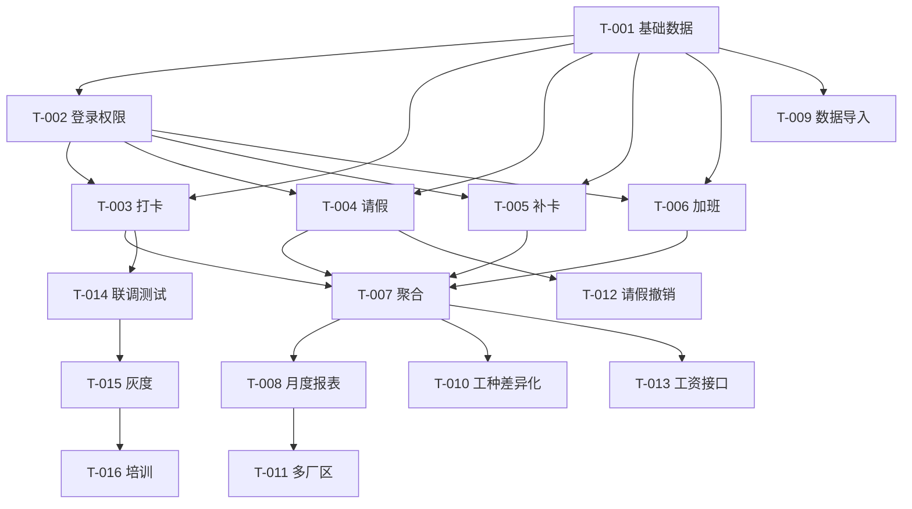

# 研发任务拆解 - 考勤管理系统

> 项目编号: 001-attendance-system
> 创建时间: 2026-06-18
> 对应产物: 09-dev-tasks.md
> 范围: P0 + P1 功能

---

## 1. 任务拆解总览

| 任务编号 | 任务名称 | 优先级 | 工时 | 负责人 | 状态 |
|----------|----------|--------|------|--------|------|
| T-001 | 基础数据管理（员工/部门/班次/考勤组） | P0 | 5d | 后端A + 前端A | 待开始 |
| T-002 | 用户登录 + 权限框架 | P0 | 3d | 后端A | 待开始 |
| T-003 | 员工打卡模块（GPS + 拍照） | P0 | 5d | 后端B + 前端B | 待开始 |
| T-004 | 请假管理（提交 + 审批） | P0 | 5d | 后端A + 前端A | 待开始 |
| T-005 | 补卡管理 | P0 | 3d | 后端A + 前端A | 待开始 |
| T-006 | 加班管理 | P0 | 3d | 后端A + 前端A | 待开始 |
| T-007 | 考勤记录聚合 | P0 | 3d | 后端B | 待开始 |
| T-008 | 月度报表（生成 + 部门拆分 + 导出） | P0 | 5d | 后端B + 前端A | 待开始 |
| T-009 | 历史数据导入 | P0 | 2d | 后端A | 待开始 |
| T-010 | 工种差异化考勤 | P1 | 3d | 后端B | 待开始 |
| T-011 | 多厂区统一管理 | P1 | 3d | 后端A | 待开始 |
| T-012 | 请假撤销 | P1 | 1d | 前端A | 待开始 |
| T-013 | 工资数据接口 | P1 | 3d | 后端A | 待开始 |
| T-014 | 联调测试 | P0 | 5d | 全员 | 待开始 |
| T-015 | 灰度发布 + 修复 | P0 | 5d | 全员 | 待开始 |
| T-016 | 培训 + 文档 | P0 | 3d | PM | 待开始 |

**总工时**: 后端 A: 22d, 后端 B: 19d, 前端 A: 19d, 前端 B: 5d, PM: 3d

## 2. 详细任务描述

### T-001: 基础数据管理

**目标**: HR 可维护员工、部门、班次、考勤组

**子任务**:
- [ ] T-001-1: 数据库表设计 + 建表 SQL
- [ ] T-001-2: 员工管理 CRUD API（5 接口）
- [ ] T-001-3: 部门管理 CRUD API（5 接口）
- [ ] T-001-4: 班次管理 CRUD API（5 接口）
- [ ] T-001-5: 考勤组管理 API（3 接口）
- [ ] T-001-6: 前端管理页面（4 个页面）
- [ ] T-001-7: 数据导入/导出

**依赖**: 无
**产出**: 5 张表 + 18 个 API + 4 个页面
**验收**: 08-acceptance.md 中 AC-FN-501/502/503

---

### T-002: 用户登录 + 权限框架

**目标**: 集成钉钉/企微登录 + RBAC 权限

**子任务**:
- [ ] T-002-1: 钉钉 OAuth 接入
- [ ] T-002-2: 企微 OAuth 接入
- [ ] T-002-3: 统一登录态管理（JWT）
- [ ] T-002-4: RBAC 框架（角色 + 权限点）
- [ ] T-002-5: 数据隔离中间件（按部门过滤）
- [ ] T-002-6: 审计日志中间件

**依赖**: T-001
**产出**: 1 个完整登录模块
**验收**: 权限矩阵 07-permission.md

---

### T-003: 员工打卡模块

**目标**: 员工通过手机定位 + 拍照打卡

**子任务**:
- [ ] T-003-1: GPS 定位 + 围栏校验 API
- [ ] T-003-2: 拍照上传 API（OSS 存储）
- [ ] T-003-3: 打卡时间窗口判定逻辑
- [ ] T-003-4: 蓝牙辅助定位（可选）
- [ ] T-003-5: 移动端打卡页面
- [ ] T-003-6: 离线缓存 + 同步
- [ ] T-003-7: 打卡历史页面

**依赖**: T-001, T-002
**产出**: 5 个 API + 2 个页面
**验收**: AC-FN-001/002/003/004

---

### T-004: 请假管理

**目标**: 请假申请 + 多级审批

**子任务**:
- [ ] T-004-1: 请假申请 API（提交/撤销/查询）
- [ ] T-004-2: 审批流引擎（按天数自动选择审批人）
- [ ] T-004-3: 24h 未审批自动升级
- [ ] T-004-4: 审批通知（钉钉/企微）
- [ ] T-004-5: 年假/调休余额自动扣减
- [ ] T-004-6: 移动端请假申请页面
- [ ] T-004-7: PC 端审批列表 + 详情页

**依赖**: T-001, T-002
**产出**: 6 个 API + 3 个页面
**验收**: AC-FN-101/102/103/104

---

### T-005: 补卡管理

**目标**: 补卡申请 + 审批

**子任务**:
- [ ] T-005-1: 补卡 API（提交/审批/查询）
- [ ] T-005-2: 3 天期限校验
- [ ] T-005-3: 每月 3 次限制
- [ ] T-005-4: 移动端补卡页面
- [ ] T-005-5: PC 端审批页面

**依赖**: T-001, T-002
**产出**: 4 个 API + 2 个页面
**验收**: AC-FN-201/202/203

---

### T-006: 加班管理

**目标**: 加班申请 + 审批 + 调休累计

**子任务**:
- [ ] T-006-1: 加班 API
- [ ] T-006-2: 加班换算逻辑（工作日/周末/节假日）
- [ ] T-006-3: 调休余额自动累计
- [ ] T-006-4: 移动端加班页面
- [ ] T-006-5: PC 端审批页面

**依赖**: T-001, T-002
**产出**: 4 个 API + 2 个页面
**验收**: AC-FN-301/302/303

---

### T-007: 考勤记录聚合

**目标**: 实时计算每位员工当日/当月考勤统计

**子任务**:
- [ ] T-007-1: 打卡记录写入
- [ ] T-007-2: 异常检测（迟到/早退/缺卡）
- [ ] T-007-3: 请假/加班状态合并
- [ ] T-007-4: 月度统计聚合

**依赖**: T-003, T-004, T-005, T-006
**产出**: 聚合服务
**验收**: 月度报表数据准确性

---

### T-008: 月度报表

**目标**: 自动生成 + 部门拆分 + 导出

**子任务**:
- [ ] T-008-1: 定时任务（月初 08:00）
- [ ] T-008-2: 报表生成逻辑（全公司 + 部门拆分）
- [ ] T-008-3: Excel 导出（EasyExcel）
- [ ] T-008-4: PDF 导出（iText）
- [ ] T-008-5: 邮件发送（按权限）
- [ ] T-008-6: 部门报表 PC 页面
- [ ] T-008-7: 全公司报表 PC 页面

**依赖**: T-007
**产出**: 报表服务 + 2 个页面
**验收**: AC-FN-401/402/403

---

### T-009: 历史数据导入

**目标**: 批量导入过去 1 年纸质考勤记录

**子任务**:
- [ ] T-009-1: Excel 模板下载
- [ ] T-009-2: 批量解析（EasyExcel）
- [ ] T-009-3: 异常行报告生成
- [ ] T-009-4: 导入进度展示

**依赖**: T-001
**产出**: 导入功能
**验收**: AC-FN-503

---

### T-010: 工种差异化考勤（P1）

**目标**: 车间工人按工时，办公室按打卡次数

**子任务**:
- [ ] T-010-1: 工种字段（employee.work_type）
- [ ] T-010-2: 考勤组配置支持工种规则
- [ ] T-010-3: 月度统计按工种分组

**依赖**: T-007
**验收**: 工种差异化统计正确

---

### T-011: 多厂区统一管理（P1）

**目标**: 集团账号管理多厂区

**子任务**:
- [ ] T-011-1: 厂区表
- [ ] T-011-2: 考勤组关联厂区
- [ ] T-011-3: 报表按厂区筛选

**依赖**: T-001
**验收**: 多厂区数据正确

---

### T-012: 请假撤销（P1）

**目标**: 员工可撤销待审批请假

**子任务**:
- [ ] T-012-1: 撤销 API
- [ ] T-012-2: 移动端撤销按钮

**依赖**: T-004
**验收**: 撤销功能可用

---

### T-013: 工资数据接口（P1）

**目标**: 暴露数据接口供工资系统调用

**子任务**:
- [ ] T-013-1: 开放 API（GET /api/v1/payroll/attendance）
- [ ] T-013-2: 字段映射文档
- [ ] T-013-3: 接口权限校验
- [ ] T-013-4: 调用日志

**依赖**: T-007
**验收**: AC-FN-402

---

### T-014: 联调测试

**目标**: 前后端联调 + 集成测试

**子任务**:
- [ ] T-014-1: 接口联调（按场景）
- [ ] T-014-2: 关键流程 E2E 测试
- [ ] T-014-3: 性能压测

**依赖**: T-003~T-013
**产出**: 测试报告

---

### T-015: 灰度发布 + 修复

**目标**: 50% 员工试运行，修复问题

**子任务**:
- [ ] T-015-1: 灰度发布 50% 员工
- [ ] T-015-2: 收集反馈
- [ ] T-015-3: Bug 修复
- [ ] T-015-4: 全量发布

**依赖**: T-014
**产出**: 灰度报告

---

### T-016: 培训 + 文档

**目标**: HR + 部门负责人培训

**子任务**:
- [ ] T-016-1: 用户手册
- [ ] T-016-2: HR 培训
- [ ] T-016-3: 部门负责人培训

**依赖**: T-015

---

## 3. 任务依赖图

## 4. 里程碑

| 阶段 | 时间 | 关键任务 |
|------|------|----------|
| M1 基础就绪 | 2026-07-15 | T-001, T-002 完成 |
| M2 核心业务 | 2026-08-15 | T-003, T-004, T-005, T-006, T-007 完成 |
| M3 报表 + 集成 | 2026-08-31 | T-008, T-009, T-010, T-011, T-013 完成 |
| M4 联调 + 灰度 | 2026-09-20 | T-014, T-015 完成 |
| M5 上线 | 2026-09-30 | T-016 完成 + 全量发布 |

## 5. 资源分配

| 角色 | 人数 | 任务 |
|------|------|------|
| 后端 A | 1 | T-001 (后端) / T-002 / T-004 / T-005 / T-006 / T-009 / T-011 / T-013 |
| 后端 B | 1 | T-003 / T-007 / T-008 / T-010 |
| 前端 A | 1 | T-001 (前端) / T-004 / T-005 / T-006 / T-008 / T-012 |
| 前端 B | 1 | T-003 |
| PM | 1 | T-016 + 项目管理 |
| QA | 1 | T-014 + 验收 |

## 6. 风险与应对

| 风险 | 影响 | 应对 |
|------|------|------|
| 钉钉/企微集成延期 | 高 | 提前 1 周预研 + 备选方案 |
| GPS 定位不准 | 中 | 蓝牙辅助 + 人工申诉 |
| 800 人并发性能 | 中 | 提前 1 周压测 |
| HR 培训不到位 | 中 | 制作视频教程 + 现场培训 |

---

**下一步**: 进入 Step 10 评审日志。
