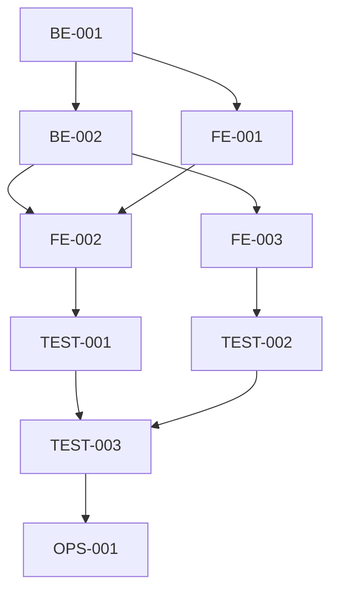

# 研发任务文档

> 本模板定义研发任务的标准拆解格式。按前端/后端/测试分类，每个任务标注依赖、工时、验收关联。

---

## 1. 前端任务

### FE-{{编号}}: {{任务标题}}

**依赖**: {{如：BE-001（数据模型API）}}
**预估工时**: {{如：2天}}
**验收关联**: {{如：AC-001, AC-002}}
**负责人**: {{前端开发}}

**任务描述**:
{{详细描述要做什么，包含具体页面、组件、交互要求}}

**交付物**:
- {{如：合同列表页面（含筛选、表格、分页、批量操作）}}
- {{如：合同表单组件（含字段校验）}}

---

### FE-{{编号}}: {{任务标题}}

（重复上述格式）

---

## 2. 后端任务

### BE-{{编号}}: {{任务标题}}

**依赖**: {{如：无}}
**预估工时**: {{如：3天}}
**验收关联**: {{如：AC-001, AC-003, AC-005}}
**负责人**: {{后端开发}}

**任务描述**:
{{详细描述，包含数据模型、API接口、业务逻辑}}

**交付物**:
- {{如：合同数据模型 + CRUD接口}}
- {{如：审批流程引擎接口}}
- {{如：权限中间件}}

**API接口定义**:

| 接口 | 方法 | 路径 | 入参 | 出参 | 说明 |
|------|------|------|------|------|------|
| {{如：合同列表}} | GET | /api/v1/contracts | page,size,filter | {list,total} | 分页查询 |
| {{如：合同详情}} | GET | /api/v1/contracts/:id | id | {contract} | 单条查询 |
| {{如：创建合同}} | POST | /api/v1/contracts | contract数据 | {id} | 新建 |
| {{如：更新合同}} | PUT | /api/v1/contracts/:id | contract数据 | {success} | 编辑 |
| {{如：删除合同}} | DELETE | /api/v1/contracts/:id | id | {success} | 删除 |
| {{如：提交审批}} | POST | /api/v1/contracts/:id/submit | id | {success} | 发起审批 |
| {{如：审批操作}} | POST | /api/v1/contracts/:id/approve | id,action,comment | {success} | 通过/退回 |

---

### BE-{{编号}}: {{任务标题}}

（重复上述格式）

---

## 3. 测试任务

### TEST-{{编号}}: {{任务标题}}

**依赖**: {{如：FE-001, BE-001}}
**预估工时**: {{如：1天}}
**验收关联**: {{如：AC-001}}
**负责人**: {{测试}}

**测试场景清单**:

| 编号 | 测试场景 | 测试步骤 | 预期结果 |
|------|----------|----------|----------|
| TC-001 | {{正常创建合同}} | {{步骤}} | {{结果}} |
| TC-002 | {{审批通过}} | {{步骤}} | {{结果}} |
| TC-003 | {{审批退回}} | {{步骤}} | {{结果}} |
| TC-004 | {{并发编辑}} | {{步骤}} | {{结果}} |
| TC-005 | {{权限限制}} | {{步骤}} | {{结果}} |

---

### TEST-{{编号}}: {{任务标题}}

（重复上述格式）

---

## 4. 运维/部署任务

### OPS-{{编号}}: {{任务标题}}

**依赖**: {{如：全部开发任务}}
**预估工时**: {{如：1天}}

**任务描述**:
{{部署配置、数据库初始化、监控接入等}}

---

## 5. 任务执行顺序

**建议执行顺序**：
1. {{BE-001}} → 2. {{BE-002}} → 3. {{FE-001}} → 4. {{FE-002, FE-003并行}} → 5. {{TEST-001, TEST-002并行}} → 6. {{TEST-003集成测试}} → 7. {{OPS-001部署}}

**总预估工时**: {{如：15个工作日}}

---

## 6. 任务总览

| 编号 | 类型 | 任务标题 | 依赖 | 工时 | 优先级 | 状态 |
|------|------|----------|------|------|--------|------|
| BE-001 | 后端 | {{标题}} | 无 | {{天数}} | P0 | 待开始 |
| BE-002 | 后端 | {{标题}} | BE-001 | {{天数}} | P0 | 待开始 |
| FE-001 | 前端 | {{标题}} | BE-001 | {{天数}} | P0 | 待开始 |
| FE-002 | 前端 | {{标题}} | BE-002 | {{天数}} | P1 | 待开始 |
| FE-003 | 前端 | {{标题}} | BE-002 | {{天数}} | P1 | 待开始 |
| TEST-001 | 测试 | {{标题}} | FE-001 | {{天数}} | P0 | 待开始 |
| TEST-002 | 测试 | {{标题}} | FE-002 | {{天数}} | P1 | 待开始 |
| TEST-003 | 测试 | {{标题}} | 全部 | {{天数}} | P0 | 待开始 |
| OPS-001 | 运维 | {{标题}} | TEST-003 | {{天数}} | P0 | 待开始 |