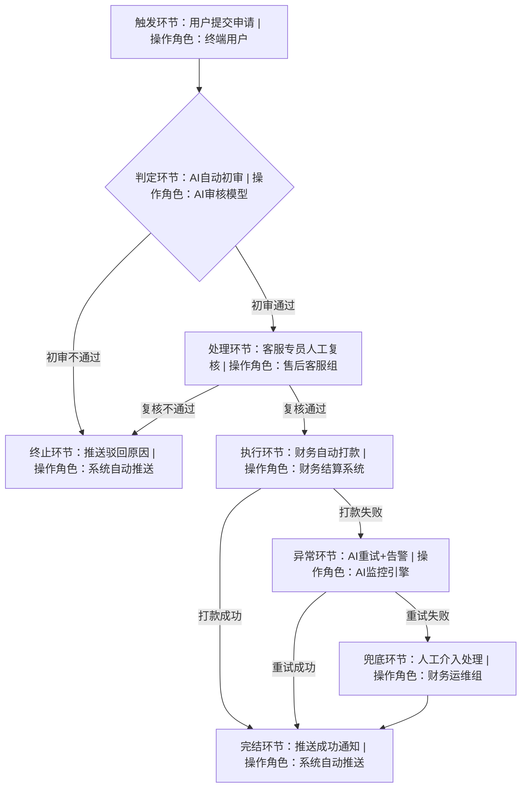

# AI 售前需求文档合并模板

> **使用说明**：本模板整合了《功能需求文档模版/示例》《大屏类需求文档模版/样例》《工单流程类需求模版及样例》《事件场景类需求模版及样例》6 份原始模板，适用于 AI 售前场景下"客户需求到演示 Demo"类的综合需求文档编制。
>
> **模板结构**：
> 1. 通用部分（任何类型需求必填）
> 2. 功能业务需求（适用于功能类）
> 3. 大屏类需求（适用于大屏类）
> 4. 工单流程类需求（适用于工单/流程类）
> 5. 事件场景类需求（适用于事件场景类）
> 6. 接口需求
> 7. 附录
>
> **填写要求**：除"示例"字样内容为参考样例外，正文中的"书写要求"段落为该字段的撰写规范，需严格按照规范填写。

---

# 一、通用部分（必填）

## 1. 文档信息

| 项目 | 内容 |
| --- | --- |
| 文档名称 | [需求名称，如：XX 系统 XX 需求] |
| 文档版本 | V1.0 |
| 编写人 |  |
| 编写部门 |  |
| 编写日期 | YYYY-MM-DD |
| 文档密级 | 公开 / 内部 / 秘密 |

### 1.1 修改记录

| 版本 | 修改日期 | 修改人 | 修改章节及内容 |
| --- | --- | --- | --- |
| V1.0 |  |  |  |
|  |  |  |  |

### 1.2 需求确认记录

| 版本 | 公文文号 | 审批部门 | 角色 | 签字 | 审批日期 |
| --- | --- | --- | --- | --- | --- |
|  |  |  |  |  |  |

> **说明**：本页需求确认记录表格应打印签字、存档。

---

## 2. 需求基础信息

| 字段名称 | 字段说明 | 填写示例 |
| --- | --- | --- |
| 需求ID | 唯一标识，AI追溯核心，格式：类型-日期-序号（数据:D/流程:P/功能:F） | D-20260321-001 |
| 需求名称 | 简洁概括核心目标，无修饰语 | 用户行为日志数据清洗与宽表构建 |
| 需求提出人 | 姓名+部门+联系方式 | 张三-数据部-138XXXX1234 |
| 开发类型 | 固定选择：数据开发/流程开发/功能开发 | 功能开发 |
| 优先级 | P0(紧急)/P1(高)/P2(中)/P3(低) | P1 |
| 题目类型 | 客户需求到演示Demo类 / 其他 | 客户需求到演示Demo类 |
| 业务条线 | 业务支撑/算网运营/网络监控/资产运营/其他 | 业务支撑 |
| 客户 | 提出需求的客户/部门 | XX公司财务部 |
| 版本号 | 初始V1.0，变更迭代升级 | V1.0 |
| 预计上线时间 | YYYY-MM-DD | 2026-04-10 |
| 关联AI SDD配置 | 绑定AI开发环境参数、模型、数据集 | AI数据清洗模型V2.0、离线计算集群 |

---

## 3. 业务背景

**填写要求**：需求背景需客观、简洁、逻辑清晰，说明需求来源、业务现状、核心问题及提出必要性。应基于真实场景、数据或政策，明确当前痛点、效率瓶颈或业务机遇，不写解决方案与功能细节。内容聚焦"为何要做"，统一项目相关方认知，为后续需求分析、方案设计提供依据，确保阅读者快速理解需求合理性与价值，字数精简、重点突出、无冗余信息。

**示例**：
在重大活动保障、节假日保障及应急保障期间，传输网络的稳定性直接影响整体通信服务质量。当前网络综合指挥调度平台缺乏针对传输专业的调度可视化模块，运维管理者无法直观掌握全省各市县传输环路退服情况、故障趋势及 T1-T5 物理 / 逻辑站调度状态，导致故障定位滞后、调度决策缺乏数据支撑，难以快速响应传输网络异常。为解决上述痛点，需新增传输调度模块，实现传输故障与调度状态的集中可视化展示，提升保障期间传输专业的运维调度效率。

---

## 4. 需求目标

**填写要求**：需求目标应明确、可衡量、可达成、相关性强、有时限（SMART），聚焦本次需求要实现的业务、产品或用户价值，不描述功能实现细节。需从业务提升、用户体验、效率优化、风险管控等维度提炼，量化关键指标，清晰说明"要做成什么样、达到什么效果"，确保所有参与方对交付结果达成共识，为需求范围、验收标准、效果评估提供统一依据，语言精炼、方向清晰、无歧义。

**示例**：
通过构建传输专业的调度可视化模块，实现传输调度数据"一站式可视化"，运维人员无需跨系统查询数据，核心数据获取操作步骤≤3 步，支撑运维人员直观掌握全省各市县传输环路退服情况，提升保障期间传输专业的运维调度效率。

---

## 5. 需求相关人员（干系人）

**填写要求**：主要说明客户需求干系人、我方需求干系人。需清晰、可追溯、权责明确，如实记录需求提出方、提出时间、提出场景及原始依据，包括业务部门、用户反馈、运营数据、合规要求、竞品分析、上级指令等。

### 5.1 客户方干系人

| 姓名 | 所属部门 | 职务 | 负责内容 | 备注 |
| --- | --- | --- | --- | --- |
| XXX | 网络部 | 监控室负责人 | 需求提出、业务规则确认、验收评审 | 核心决策人 |
| XXX | 网络部监控室 | 运维人员 | 日常使用模块、反馈使用问题 | 最终用户 |

### 5.2 我方干系人

| 姓名 | 所属部门 | 职务 | 负责内容 | 备注 |
| --- | --- | --- | --- | --- |
| XXX | 产品部 | 产品经理 | 需求梳理、文档编写、方案设计 | 需求负责人 |
| XXX | 研发部 | 后端开发工程师 | 接口开发、数据对接 | 技术实现 |
| XXX | 研发部 | 前端开发工程师 | 页面可视化开发、交互实现 | 界面开发 |
| XXX | 测试部 | 测试工程师 | 功能测试、性能测试、验收测试 | 质量保障 |

---

## 6. 重要程度（必填）

**填写要求**：描述该需求的重要程度，分为一般、重要、非常重要。

| 重要程度 | 含义说明 |
| --- | --- |
| 一般 | 业务影响有限，常规优化 |
| 重要 | 业务影响较大，优先安排 |
| 非常重要 | 业务影响重大，影响核心指标或合规要求 |

---

## 7. 需求来源（必填）

**填写要求**：明确需求来源，最终来源客户、系统、项目。

**示例**：
- 来源客户：北京移动监控室
- 系统：指挥调度系统
- 项目：网络门户项目

---

## 8. 应用场景（必填）

| 应用场景 |  |
| --- | --- |
| 应用部门 |  |
| 应用岗位、人数及使用频次 |  |
| 预期应用效果 |  |

**示例**：

| 应用场景 | 智慧监控大厅 |
| --- | --- |
| 应用部门 | 云网中心 |
| 应用岗位、人数及使用频次 | 监控室值班人员 8 人/班次，7×24 小时使用 |
| 预期应用效果 | 实现网络态势一屏掌控、处置过程全程可视、指挥调度智能高效 |

---

## 9. 需求约束与边界

- **技术约束**：AI SDD环境兼容要求、数据权限、算力限制、接口规范
- **业务约束**：合规要求、数据脱敏、流程审批权限、功能使用范围
- **边界说明**：明确需求**包含内容**、**不包含内容**，杜绝需求蔓延

---

## 10. 验收标准

**填写要求**：AI可自动校验+人工可复核的量化指标，含功能达标、性能指标、准确率、耗时、覆盖率等。

| 验收维度 | 量化指标 | 验证方式 |
| --- | --- | --- |
| 功能覆盖 | 需求功能点100%落地 | AI用例自动回归 |
| 性能 | 页面加载≤3秒，接口响应≤1秒 | 压测 + AI巡检 |
| 准确率 | ≥90% | 抽样对比 |
| 安全 | 越权拦截100% | 渗透测试 |
| 可用性 | 7×24小时稳定运行 | 监控告警 |

---

## 11. 变更与追溯记录

| 版本号 | 变更时间 | 变更人 | 变更内容 | AI校验结果 |
| --- | --- | --- | --- | --- |
| V1.0 | 2026-03-21 | 张三 | 需求初稿提交 | AI解析通过，无歧义 |

---

# 二、系统总体架构

**填写要求**：需求系统概述需简洁说明本次需求涉及的系统名称、所属模块、系统定位及上下游关系，明确与其他系统、接口、硬件或第三方平台的交互逻辑，简要描述整体业务流程与核心处理机制，不展开细项功能。重点阐述系统在本次需求中的作用、边界范围及整体设计思路，帮助阅读者快速建立整体架构认知，为后续功能、流程、接口等详细设计提供整体框架，内容条理清晰、范围明确、无冗余细节。

**示例**：
模块通过对接现有平台传输专业数据接口获取明细数据，经数据处理层完成清洗、统计、格式转换后，生成可视化图表及结构化表格；运维人员通过查看图表掌握整体状态，通过下钻明细获取具体故障信息，最终依据数据开展调度执行或故障修复动作，形成"数据输入 - 处理 - 展示 - 决策 - 执行"的完整业务闭环。

---

# 三、系统能力需求

## 3.1 系统性能需求

**填写要求**：
1. 业务规模需求（必须）
2. 数据精度（可选）
3. 时间特性（必须）
4. 准确率
5. 可靠性
6. 灵活性（可选）

**示例**：
- 业务规模：满足1000人以上访问；支持50用户并发。
- 数据精度：保证用户数据、权限控制、数据获取、应用数据及安全、统计、算费支付等准确无误。
- 时间特性：网页响应时间（不考虑网络延迟）≤15秒；监测时长5分钟/台；500台主机监测任务在8小时内正常运行。
- 准确率：≥90%。
- 可靠性：可靠监测时间大于8小时。
- 灵活性：友好用户界面、独立接口、较强可移植性，兼容多种容器和发布方式。

**性能指标细化（按需）**：
- 页面加载性能：首次加载时间≤3 秒，二次加载时间≤1 秒；
- 数据更新性能：数据同步延迟≤5 分钟，刷新操作响应时间≤1 秒；
- 并发性能：支持≥50 名用户同时在线操作，无卡顿、崩溃现象；
- 下钻性能：点击标蓝数字跳转详表页面响应时间≤0.5 秒。

## 3.2 系统安全性需求

**填写要求**：
1. 应用安全
2. 数据安全
3. 访问控制
4. 安全审计

**示例**：
- **应用安全**：满足多层次应用漏洞防范功能，如预防SQL注入、跨站脚本攻击等应用安全漏洞。
- **数据安全**：符合《中国移动业务支撑网数据安全管理办法 1.0》要求，数据库和其他文件只能被授权用户访问和修改；账号口令、操作控制信息等应采用加密方式传输；采集数据的传输采用加密方式传输。
- **访问控制**：满足界面、菜单等权限不出现越级访问。
- **安全审计**：用户权限修改、重要数据修改等关键操作日志记录。

## 3.3 可靠性与容错性

**示例**：
- 接口异常处理：接口调用失败时，页面显示"数据加载失败，请重试"提示，支持用户点击重试按钮重新获取数据；
- 数据异常处理：返回数据存在缺失、格式错误时，对应字段显示"-"，不影响整体页面展示；
- 操作容错：用户误点击时无异常跳转，支持返回上一级操作；
- 操作日志：记录用户登录、数据查看、下钻操作等行为日志，日志保留周期≥180天，支持追溯审计。

---

# 四、环境需求

## 4.1 硬件环境

**填写要求**：硬件环境章节需明确说明系统运行、部署及测试所需的服务器、终端、网络、外设等硬件配置要求，包括服务器型号、CPU、内存、硬盘、带宽、网络架构、供电及散热条件，注明生产、测试、演示等不同环境的差异配置。要求指标具体、可落地、可核验，明确最低配置与推荐配置。

**示例**：

| 设备名称 | 设备型号 | 新购/沿用 | 数量 | 配置描述 | 备份 |
| --- | --- | --- | --- | --- | --- |
| 服务器 | IBM X3650M5 | 新购 | 5 | CPU: Intel Xeon SP Gold 5218R 2.1GHz 20核*2；内存：64GB DDR4；系统盘：480GB SSD*2；数据盘：1.92TB SSD*2；网卡：2*10GE | 部署数据库、中间件、数据存储等 |
| 网络交换器 | S5700-24TP-SI-AC | 沿用 | 2 | 10/100/1000Mbps，24口三层企业管理千兆交换机 | 华为 |
| 显示器 | S22B310B | 沿用 | 5 | 21.5英寸宽屏LED背光液晶显示器 | SAMSUNG |

> **注明**：沿用代表现有的设备，状况良好，仍能继续使用。

## 4.2 软件环境

**填写要求**：明确系统运行、部署、测试所需的操作系统、中间件、数据库、开发框架、浏览器及第三方依赖软件版本，区分生产、测试、开发等不同环境配置，注明兼容范围与最低版本要求。

**示例**：

| 软件名称 | 软件类型 | 版本 | 描述 |
| --- | --- | --- | --- |
| MySQL | 数据库 | 5.5 | 关系型数据库管理系统 |
| tomcat | 中间件 | 8.5.x | 解析、发布网页等，纯java开发 |
| 操作系统 | Linux | 5.5 | 自由传播的类Unix操作系统 |
| IE浏览器 | 前台 | IE7以上 | 微软网页浏览器 |

---

# 五、功能业务需求

## 5.1 业务架构图

**填写要求**：业务架构图需清晰呈现整体业务流程、核心模块、角色职责及上下游系统交互关系，明确业务域边界、流转逻辑与层级关系，准确反映业务现状或目标架构。图中要素统一规范、命名一致，重点突出、无冗余信息，需附简要文字说明。

**说明**：模块通过对接现有平台 XX 专业数据接口获取明细数据，经数据处理层完成清洗、统计、格式转换后，生成可视化图表及结构化表格；运维人员通过查看图表掌握整体状态，通过下钻明细获取具体故障信息，最终依据数据开展调度执行或故障修复动作，形成"数据输入 - 处理 - 展示 - 决策 - 执行"的完整业务闭环。

## 5.2 功能需求描述

**填写要求**：根据业务功能划分，对每个业务功能的标识号、优先级、定义、业务流程、约束条件等内容，必须准确地、无二义性、完整地进行详细描述，避免产生歧义。

- **标识号编写规则**：如：需求说明书类型＋业务功能＋子业务功能+需求类型+编号
  - 需求说明书类型：URS（User Requirement Specification：用户需求说明书）、SRS（Software Requirement Specification：软件需求规格说明书）、NFRS（NON-Function Requirement Specification：非功能需求说明书）
  - 需求类型：F 功能需求（Function）、W 界面需求（Window）、R 角色权限需求（Role）、NF 非功能需求（NON-Function）、I 接口需求（Intercace）
- **优先级划分原则**：较高、高、一般、低、较低

### 5.2.1 三级功能点描述

**填写要求**：对功能需求进行详细描述，按照三级功能点进行划章节描述。功能需求描述需采用可落地、可验证、无歧义的原则，按用户角色、触发条件、操作流程、系统响应、约束规则完整表述，明确功能目标、输入输出、业务规则、异常处理及页面交互逻辑。每条功能可单独验收。

**功能点描述模板**：

| 项目 | 内容 |
| --- | --- |
| 功能编号 | F-XXX-XXX-XXX |
| 功能名称 |  |
| 用户角色 |  |
| 触发条件 |  |
| 操作流程 | 1. ... 2. ... 3. ... |
| 输入 |  |
| 输出 |  |
| 业务规则 |  |
| 异常处理 |  |
| 权限控制 |  |

**示例**：
**功能名称**：环路中断渲染图展示
- **触发条件**：模块初始化加载或用户手动刷新页面
- **操作主体**：用户
- **处理逻辑**：功能触发后，模块获取传输专业全量环路退服接口数据，按市县维度统计退服占比（退服环路数 / 总环路数 ×100%），并采用地图渲染方式直观展示。
- **输出结果**：输出全省各市县环路退服占比渲染图，地图上将明确标注每个市县的具体退服百分比。

## 5.3 业务规则、模型和算法

**填写要求**：业务规则、算法需明确、严谨、可量化、可执行，详细描述业务逻辑、约束条件、判断分支、计算公式、阈值口径及异常处理机制，确保无歧义、可开发、可校验。

**示例**：

| 类别 | 指标 | 数据源 | 算法 | 时间粒度 | 空间粒度 | 样例数据 |
| --- | --- | --- | --- | --- | --- | --- |
| 退服占比 | 市县环路退服占比 | 平台首页传输专业全量环路退服接口 | 退服环路数 / 总环路数 ×100% | 5 分钟 / 次 | 市县级 | 海口 0.42%、东方 0.34% |
| 故障趋势 | 环路中断数量 | 平台首页传输专业环路中断趋势接口 | 按时间节点聚合统计 | 15 分钟 / 个节点 | 省级 | 2025-07-23 07:30:00 故障数 35 |
| 物理故障统计 | 各类故障数量 | T1-T5 物理故障调度情况表接口 | 按故障类型、市县维度分组统计 | 5 分钟 / 次 | 市县级 | 全省断 2 边数量 0、断 1 边数量 22 |
| 逻辑故障统计 | 各类故障数量 | T1-T5 逻辑故障调度情况表接口 | 按故障类型、市县维度分组统计 | 5 分钟 / 次 | 市县级 | 儋州影响逻辑基站数 7 |

## 5.4 涉及数据

**填写要求**：涉及数据章节需明确本次需求所使用、产生、交互的全部数据项，包括数据来源、口径定义、类型、格式、长度、值域、更新频率、存储周期及权限控制，重点说明 O 域等核心数据源的采集方式与使用规则。

**示例**：

| 数据项 | 数据来源 | 口径定义 | 类型 | 更新频率 | 存储周期 | 权限控制 |
| --- | --- | --- | --- | --- | --- | --- |
| 环路退服数据 | 系统内汇总 | 全省各市县传输环路退服数量、总环路数量 | 结构化数据 | 5 分钟 / 次 | 90 天 | 运维人员只读 |
| 环路中断趋势数据 | 系统内汇总 | 近 24 小时各时间节点环路中断数量 | 结构化数据 | 15 分钟 / 次 | 90 天 | 运维人员只读 |
| 物理故障调度数据 | 系统内汇总 | 各市县 T1-T5 物理站断边、故障、影响基站等数据 | 结构化数据 | 5 分钟 / 次 | 90 天 | 运维人员只读 |
| 逻辑故障调度数据 | 系统内汇总 | 各市县 T1-T5 逻辑站断边、故障、影响基站等数据 | 结构化数据 | 5 分钟 / 次 | 90 天 | 运维人员只读 |
| 故障明细数据 | 故障系统 | 具体故障的发生时间、告警标题、状态等详情 | 结构化数据 | 实时 | 180 天 | 运维人员只读 |

## 5.5 功能需求原型

**填写要求**：功能需求原型描述需清晰说明原型对应的功能模块、页面结构、交互流程与元素说明，明确页面布局、操作入口、字段展示、状态变化及跳转逻辑。原型需与功能需求一一对应，直观呈现业务场景与用户操作路径，标注关键规则、异常提示、权限控制及数据来源。

**示例**：
- 模块入口：网络综合指挥调度平台首页→"指挥调度" 菜单→"传输调度" 子模块，点击进入模块页面；
- 原型及交互逻辑：传输调度模块呈现如下，默认情况右方呈现T1-T5物理调度情况。
  1. 渲染图：环路中断渲染图数据来源首页传输专业全量环路退服。
  2. 趋势图：环路中断趋势图数据来源首页传输专业全量环路中断趋势图。
  3. T1-T5物理站调度表：点击标蓝数字可下钻，跳转至"T1-T4物理故障详表"呈现详情。
  4. T1-T5逻辑站调度表：点击标蓝数字可下钻，跳转至"T1-T4逻辑故障详表"呈现详情。

> **提供UI原型图**：放置高保真UI原型界面图，要求要素齐全，直观呈现业务数据内容与用户操作路径。

---

# 六、大屏类需求（适用于大屏可视化场景）

## 6.1 总体需求

### 6.1.1 总体需求描述

**填写要求**：站在业务视角，简述业务目标、业务场景、业务流程及核心功能，说明需求要解决的实际业务问题，体现业务价值与管理要求。内容应客观真实、逻辑清晰，聚焦"做什么业务、解决什么问题、达成什么效果"，不涉及功能实现与技术细节。

**示例（大屏类）**：
智慧大屏作为监控智慧大厅的主要入口，大屏重点呈现网络运行状态、事件处置过程以及具备智能化交互接口：

- **网络运行状态呈现**：呈现需重点关注的网络及业务运行状态，包括动环机房停电、传输断点、基站和OLT退服等网络故障事件，以及投诉、割接、突发事件概览。
- **事件处置过程呈现**：呈现具体故障事件的全流程自动化处理信息、进展和结论。
- **智能化交互接口**：呈现当日监控工作事项、实时需人工介入任务、数字员工配置运行情况。同时接入监控大模型的人机交互界面，支持网络运行情况查询、大屏指令操作和切换、网络态势讲解播报等。

### 6.1.2 大屏分辨率要求

**填写要求**：明确大屏的分辨率大小。

**示例**：大屏分辨率：5760*1080

### 6.1.3 大屏整体设计图

> **添加高保真 UI 设计图**。

## 6.2 功能需求

> 复制以下模块，按需增加"功能模块N"。每个模块必须包含功能说明、界面原型、涉及数据三部分。

### 6.2.1 功能模块一：[模块名称]

#### 功能说明

**填写要求**：准确描述该模块功能的呈现内容、操作逻辑及过程及预期效果，做到清晰、无歧义、可开发、可测试。应与业务原始需求、原型保持一致，明确功能边界，不涉及技术实现方案。

**示例**：大屏左屏呈现网络运行情况模块，所涉及专业内容包含核心网（核心网CS域、核心网PS域、IMS）、IP承载网、CMNET、无线、传输、动环、集客、家客、网络云、物联网、性能、安全、IDC，分别统计各专业的告警数量，并进行呈现。

> 下钻交互：点击各统计数据二级下钻弹框呈现当前专业下的告警详情，详情内容分为故障工单触发和事件工单触发两类。
> 三级下钻：点击事件ID可进行事件关联告警、割接、投诉、舆情、指标查看。

#### 界面原型

> **放置UI原型界面图**，要求要素齐全，直观呈现业务数据内容与用户操作路径。需提供：
> - 默认呈现内容
> - 点击下钻内容
> - 事件操作
> - 三级页面

#### 涉及数据

**填写要求**：明确该功能模块所使用、产生、交互的全部数据项，包括数据来源、数据字段、数据类型。

**示例**：
- 数据来源：EMOS告警牌，EMOS直接推送给浪潮获取数据
- 二级下钻告警详情字段：事件ID、工单号、故障发生事件、网元名称、事件名称、网络分类、处理组
- 三级下钻页面涉及字段：
  - 告警列表字段为：专业、网管告警流水号、地市、区县、厂家ID、厂家名称、专业ID
  - 割接列表字段为：专业、割接工单号、原因、开始时间、结束时间
  - 投诉列表字段为：专业、故障发生时间、告警流水号、投诉时间、主题
  - 舆情列表字段为：地市、区县、关键字、标题、发布时间
  - 指标列表字段为：网元类型、网元名称、指标名称、指标时间、指标值、指标单位、指标粒度、KPI表达式

### 6.2.2 功能模块二：[模块名称]

#### 功能说明

#### 界面原型

#### 涉及数据

### 6.2.3 功能模块三：[模块名称]

#### 功能说明

#### 界面原型

#### 涉及数据

---

# 七、工单流程类需求（适用于流程编排/工单流转场景）

## 7.1 流程基础信息

**示例**：
- 流程名称：资源勘察及扩容流程
- 流程类型：自动化派单 + 人工处理
- 适用场景：Crm和业编扩容工单流转
- 触发方式：CRM/业编调用电子运维接口进行派单自动触发

## 7.2 流程节点与流转规则

**填写要求**：按执行顺序列明节点名称、节点类型、执行角色、流转条件、超时规则，AI 自动生成流程画布；同步绘制标准流程图，标注节点、分支、异常链路。

### 7.2.1 环节角色说明

| 环节名称 | 角色 | 说明 |
| --- | --- | --- |
| 申请发起 | 系统自动派单 | Crm和业编 |
| 资源勘查 |  |  |
| 勘误及扩容施工 |  |  |

### 7.2.2 标准流程图（Mermaid 语法 · AI可识别）

### 7.2.3 各环节详细说明

**示例**：
1. 节点1：AI自动初审（系统节点），规则：校验订单是否已完成、退款金额≤500元、无违规记录；流转条件：通过→节点2，驳回→结束流程并推送用户
2. 节点2：客服专员复核（人工节点），角色：售后客服组，处理时限：2小时；流转条件：通过→节点3，驳回→结束流程并推送用户
3. 节点3：财务自动打款（系统节点），规则：对接支付接口完成退款；流转条件：打款成功→流程完结，打款失败→异常节点

> **提供图片样例**（流程图截图）

## 7.3 表单字段

**填写要求**：详细描述当前环节对应操作关联的表单上的详细字段信息，包含字段名称、字段类型、字段值来源、枚举值（示例说明）、字段长度、是否必填等详细内容。

| 字段名称 | 字段类型 | 字段值来源 | 枚举值（示例/说明） | 字段长度 | 是否必填 |
| --- | --- | --- | --- | --- | --- |
| 工单编号 | 文本框 | 系统生成 | 示例：XJ-ZYKC-230821-00483 | 30 字符 | 是 |
| 派单日期 | 日期时间框 | 系统自动生成（派单时） | 示例：2023-08-21 21:14:53 | 20 字符 | 是 |
| 工单标题 | 文本框 | 系统自动生成（订单号 + 地址 + 业务类型拼接） | 示例：g13205672390\|51692360759545\|阿克苏沙雅县城区...\|扩容工单 | 200 字符 | 是 |
| 订单号 | 文本框 | 业务系统同步 | 示例：51692360759545 | 30 字符 | 是 |
| 业务办理时间 | 日期时间框 | 业务系统同步 | 示例：2022-03-01 17:47:52 | 20 字符 | 是 |
| 问题原因一级 | 下拉选择框 | 枚举字典选择 | 网络原因、设备原因、业务原因等 | 20 字符 | 是 |
| 问题原因二级 | 下拉选择框 | 关联一级原因的枚举字典 | 配 ONU 失败、光功率异常、端口故障等 | 30 字符 | 是 |
| 地州 | 下拉选择框 | 行政区划字典 | 喀什、阿克苏、乌鲁木齐等 | 20 字符 | 是 |
| 区县 | 下拉选择框 | 关联地州的行政区划字典 | 莎车县、沙雅县等 | 20 字符 | 是 |
| 用户详细地址 | 多行文本框 | 业务系统同步 / 手动填写 | 示例：阿克苏沙雅县城区英巴格街金水湾小区... | 200 字符 | 是 |
| 意向用户姓名 | 文本框 | 业务系统同步 / 手动填写 | 示例：乃比・亚森 | 50 字符 | 是 |
| 意向用户账号 | 文本框 | 业务系统同步 | 示例：g13205672390 | 30 字符 | 是 |
| 意向套餐 | 下拉选择框 | 套餐字典 | 各类宽带 / 融合套餐 | 50 字符 | 否 |
| 场景类型选择 | 下拉选择框 | 场景字典 | 家庭场景、商铺场景、企业场景等 | 30 字符 | 否 |
| 派单来源 | 下拉选择框 | 派单来源字典 | 服开、运维、客服等 | 20 字符 | 是 |
| 装维人员姓名 | 文本框 | 手动填写 / 派单系统分配 | 示例：iom | 30 字符 | 是 |
| 装维人员联系方式 | 文本框（手机号） | 手动填写 / 系统同步 | 无 | 11 字符 | 否 |
| 计划完成时间 | 日期时间框 | 系统自动计算（派单日期 + 3 天） / 手动修改 | 示例：2023-08-25 21:14:53 | 20 字符 | 是 |
| 办理渠道 / 营业厅 | 文本框 / 下拉选择框 | 渠道字典 | 无 | 50 字符 | 否 |
| 相关信息详细描述 | 多行文本框 | 手动填写 | 无 | 500 字符 | 否 |
| 备注 1/2/3 | 文本框 | 手动填写 | 无 | 100 字符 | 否 |
| 附件 | 附件 | 手动上传 | 无（文件大小限制） | 否 |

### 7.3.1 处理逻辑说明

**填写要求**：详细描述当前操作的具体业务逻辑。

**示例**：
**申请发起环节处理逻辑**：无需手动起单，Crm 和业编都调用电子运维的接口进行派单，电子运维接收派单报文后对报文内容进行解析后对应到表单中，并发起流程。

> **当前操作对应的表单的 demo 截图**

## 7.4 通用字段类型说明

| 字段类型 | 适用场景 | 示例 |
| --- | --- | --- |
| 文本框 | 短文本输入 | 用户姓名、单号 |
| 文本框（手机号） | 11位手机号校验 | 联系方式 |
| 多行文本框 | 长文本/描述 | 详细地址、问题描述 |
| 下拉选择框 | 枚举值选择 | 场景类型、派单来源 |
| 关联下拉选择框 | 级联枚举 | 地州-区县、一级原因-二级原因 |
| 日期时间框 | 时间点选择 | 派单日期 |
| 人员选择框 | 选择系统内人员 | 装维人员 |
| 附件 | 文件上传 | 凭证、材料 |

## 7.5 输入输出表单

**填写要求**：明确流程各节点必填/选填字段、字段类型、校验规则、格式规范，支持AI自动生成表单模板、校验字段合法性。

### 7.5.1 输入表单（示例：退款申请单）

- **必填字段**：订单编号（16位纯数字，唯一校验）、用户ID（关联用户中心）、退款金额（≤5000元，2位小数）、退款原因（枚举值）、退款账户（脱敏展示）
- **选填字段**：问题描述（≤200字）、凭证上传（图片，≤5M）
- **AI校验规则**：订单编号查重、退款金额一致性校验、敏感词过滤

### 7.5.2 输出表单

- 初审回执单：订单编号、初审结果、驳回原因、AI审核时间、下一步节点
- 审批单：订单信息、用户信息、退款信息、复核意见、审批人、处理时间
- 退款回执单：订单编号、退款金额、到账账户、打款时间、预计到账时间、状态
- 输出格式：支持PDF下载、站内信推送、短信通知，字段脱敏展示敏感信息

## 7.6 权限与配置

- **流程配置权限**：管理员专属
- **节点操作权限**：按角色分级
- **流程参数**：支持AI可视化配置修改
- **日志审计**：所有操作留痕

---

# 八、事件场景类需求（适用于运维事件场景化场景）

## 8.1 事件处理流程

**填写要求**：事件场景的业务流程，尽量细致，最好以能力视角阐述，最粗力度也需要以业务视角阐述。

**示例**：家客故障【同一OLT下批量用户下线】事件场景整体处理流程如上图所示，其中各能力之间及内部逻辑详见各小节。

> **绘制整体流程图**（建议使用 Visio、draw.io 等工具）

> **整体说明**：通过SDO平台基于已编排完成的感知策略、预处理策略、认知策略、处置策略、恢复验证策略等进行流程串接，进而实现【事件名称】事件场景整体处理流程。

## 8.2 事件呈现要求

**填写要求**：描述下事件场景的呈现要求，包括事件详细所需的组件。比如说需要有拓扑、GIS、趋势图、柱状图等。

**示例**：
- 事件列表查询区支持按事件名称、开始时间、结束时间进行事件的查询检索
- 列表展示字段：事件等级、事件发生时间、事件名称、事件状态、业务影响情况、故障根因分析、触发来源、事件生成规则名等
- 事件详情界面：主要分基本信息、业务影响、故障根因、投诉分析、事件拓扑图/GIS地图、事件全生命周期、事件关联信息（告警信息、投诉咨询量、投诉预警——拆分为3个组件）七部分，以组件的形式提供，可进行人工拖动调整及是否展示操作

### 8.2.1 投诉分析组件

- **表格查询组件**：默认OLT设备名、开始时间、结束时间
- **趋势图组件**：横坐标 5分钟粒度，纵坐标 咨询量个数；鼠标悬浮显示该时间点的开始时间、结束时间、咨询量

### 8.2.2 事件调度看板

整体分为基本信息、调度处理流程详情、场景调度操作、事件实时动态信息四部分。调度处理流程详情，**绿色表示已执行、灰色表示不执行、蓝色表示待执行**；**A 表示自动化执行，M 表示人工操作执行**。

### 8.2.3 事件手动触发

按照固定的格式通过前台手工输入压入队列自动生成事件。

### 8.2.4 流量分析

- 横坐标：5分钟粒度，纵坐标：BRAS端口流量值（字节）
- 鼠标悬浮：显示该时间点的开始时间、结束时间、BRAS端口、BRAS端口流量

### 8.2.5 在线用户数分析

- 横坐标：15分钟粒度，纵坐标：在线用户数
- 鼠标悬浮：显示该时间点的开始时间、结束时间、在线用户数

### 8.2.6 告警清除手动同步

在事件关联告警模块，添加告警核查按钮，点击按钮进行告警清除信息同步，把告警清除信息返填到此处。

### 8.2.7 事件拓扑

家宽事件拓扑调用综资的拓扑能力，展示 bras—OLT---居民小区的逻辑拓扑，事件中故障的 OLT 进行告警渲染。

## 8.3 感知规则

**填写要求**：描述下事件场的触发方式，包括数据范围、触发条件、生成事件结果要求等。

**示例**：
- 事件触发形式：告警获取感知
- 告警来源：性能平台（检测到批量用户下线超门限时生成一条告警数据）
- 感知逻辑：获取告警数据并匹配告警标题"批量用户下线"，匹配成功则生成"同一OLT下批量用户下线事件"
- 触发感知能力编排逻辑：
  - 模型设计包含三部分：**数据接入、分析数据、分析决策**
  - 数据接入：业务对象选择"告警模型"，对应检索字段为"告警标题"
  - 分析决策：基于感知规则进行分析决策

## 8.4 预处理策略

**填写要求**：描述下事件预处理的步骤，每一个步骤的输入输出情况。

**示例**：告警分析——可针对不同类型告警（动环告警、OLT主设备告警、OLT上联传输告警、OLT下联传输告警、其他告警）分能力进行编排设计。

### 8.4.1 动环告警分析

- 数据源：集中故障
- 告警标题：包含市电停电、市电断电、整流模块故障、交流输入故障、输入中断告警、输出中断告警、交流输入停电告警、直流输入中断告警、电池组总电压过低、总电压过低、以及低压脱离、二级低压脱离、直流输出电压过低
- 告警关联对象：事件关联OLT所属机房（从综资系统获取OLT的所属机房信息）
- 告警发生时间：取事件发生时间-4h
- 告警状态：活动告警
- 输出结果：查询到x条告警，告警标题、告警发生时间；当前能力执行时间

### 8.4.2 OLT主设备告警

- 数据源：集中故障
- 告警标题：包含网管与设备通信失败、ISO、网元链路断、单板通讯故障、单板硬件异常、板卡软件未运行、板卡类型不匹配、BDMISSING、FA、XPON MAC套片故障、单板逻辑软件故障；光模块故障、光模块不在位、上行GE光口连接故障、TXFAIL、光模块温度越线、以太端口光模块温度过高、LTTEMPEXCED；GPON端口光模块硬件故障、PON口光模块不在位、OLT光模块失效、光模块高温告警、近端光收发器参数超出预警阈值、PONCOMMFAIL
- 告警对象：事件关联OLT
- 告警发生时间：取事件发生时间-5分钟
- 告警状态：活动告警

### 8.4.3 OLT上联/下联传输告警

- OLT上联传输告警：上联口链路中断、上行以太端口连线故障或端口状态异常、以太光口接收信号丢失、LINKDOWN
- OLT下联传输告警：主干光纤断或OLT检测不到预期的光信号(LOS)、[GPON告警]PON信号丢失、PONLOS

### 8.4.4 其他告警

- 分支光纤断或ONT检测不到预期的光信号(LOS)、GPON ONT掉电(DGi)

### 8.4.5 流量分析

- 数据源：IPIT
- 流量取值范围：事件关联设备—OLT上联口（主、备用端口）流量、BARS上联口（主、备用端口）流量值
- 发生时间：取事件的发生时间+/-5分钟内的流量值
- 异常判断：|（事件的发生时间-5分钟的流量值-事件的发生时间+5分钟的流量值）/事件的发生时间-5分钟的流量值| * 100 >= 70%

### 8.4.6 业务影响性分析

提供业务影响性分析能力，基于告警分析能力、流量分析能力、投诉分析能力进行业务影响性分析。
- 业务影响情况：影响xx个家宽用户
- 业务影响范围：涉及xx个小区

## 8.5 定界定位策略

**填写要求**：描述下事件定界定位的步骤，每一个步骤的输入输出情况。

**示例**：SDO平台提供 OLT退服确认、OLT板卡欠压故障确认、OLT硬件设备故障确认、OLT光缆故障确认、ONU设备掉电确认 5个能力。

### 8.5.1 OLT退服确认

| 场景 | 匹配主告警 | 匹配关联告警 | 定位结果 |
| --- | --- | --- | --- |
| 电力故障导致OLT退服 | OLT主设备告警（网管与设备通信失败、ISO、网元链路断） | 机房动环告警（市电停电、市电断电、整流模块故障...） | 电力故障导致OLT退服 |
| OLT硬件故障导致OLT退服 | OLT主设备告警（网管与设备通信失败、ISO、网元链路断） | OLT主设备告警（单板通讯故障、单板硬件异常...）但**未匹配到机房动环告警** | OLT硬件故障导致OLT退服 |

### 8.5.2 OLT板卡欠压故障确认

匹配OLT主设备告警（单板通讯故障、单板硬件异常...）及机房动环告警（市电停电...），定位为电力故障导致OLT板卡欠压。

### 8.5.3 OLT硬件设备故障确认

- OLT板卡故障告警：单板通讯故障、单板硬件异常、板卡软件未运行、板卡类型不匹配、BDMISSING、FA、XPON MAC套片故障、单板逻辑软件故障
- OLT上联口光模块故障告警：光模块故障、光模块不在位、上行GE光口连接故障、TXFAIL、光模块温度越线、以太端口光模块温度过高、LTTEMPEXCED
- OLT下联口光模块故障告警：GPON端口光模块硬件故障、PON口光模块不在位、OLT光模块失效、光模块高温告警、近端光收发器参数超出预警阈值、PONCOMMFAIL

### 8.5.4 OLT光缆故障确认

- OLT上联光缆故障：上联口链路中断、上行以太端口连线故障或端口状态异常、以太光口接收信号丢失、LINKDOWN
- OLT下联光缆故障：主干光纤断或OLT检测不到预期的光信号(LOS)、[GPON告警]PON信号丢失、PONLOS

### 8.5.5 ONU设备掉电确认

匹配其他告警（分支光纤断或ONT检测不到预期的光信号(LOS)、GPON ONT掉电(DGi)），定位为ONU设备掉电故障。

## 8.6 处置策略

**填写要求**：描述下事件处置的步骤，每一个步骤的输入输出情况。

**示例**：SDO平台提供的处置能力有**自动派单、消息通知、人工处置、OLT配置调整指令下发**4个能力。

### 8.6.1 自动派单

基于定界定位确认的故障生成创建工单任务推送给集中故障系统，将相关事件信息、告警信息、流量信息、投诉信息、故障定界定位结果等信息推送给集中故障系统。

- 输出：已于xxxx（当前能力执行时间）向集中故障系统推送自动派单任务

### 8.6.2 消息通知

短信消息：以短信形式发送给相关人员，SDO平台实现消息内容的编辑、相关人员/群组编辑，然后调用企信通的消息发送能力。

- 输出：已于xxxx向xxx（配置的消息接收人或群组）推送事件定界定位结果及自动派单信息

### 8.6.3 人工处置

人工处置方案维护：支持对相关人工处置的操作流程指导方案内容进行编辑维护。

- 输出：展示人工处置方案，后续有知识库，具体参考知识库编号

### 8.6.4 OLT配置调整指令下发

若定界定位中匹配到单板硬件异常告警时，生成 RESET-BOARD::(DID=Device-ID|DEV=Device-name),FN=frame-number,SN=slot number:CTAG 指令下发任务。

## 8.7 修复验证策略

**填写要求**：描述下事件修复验证的步骤，每一个步骤的输入输出情况。

**示例**：SDO平台提供的恢复验证能力有**上网记录查询验证、核实告警、核实线路情况、工单归档核实及人工恢复验证**5个能力。

### 8.7.1 上网记录查询验证

基于事件的关联设备信息，获取当前OLT下批量用户下线事件恢复的告警；若获取到该告警，则输出该事件已恢复；否则输出结果，事件未恢复。

### 8.7.2 核实告警

确认主告警及关联告警是否为恢复状态，若均为恢复状态，则输出该事件关联告警均已清除；否则存在xx条告警未清除。

### 8.7.3 核实线路情况

取事件关联OLT上联口光功率均值（从家客系统获取），并与标准值进行对比分析。

**光功率标准参考**：

| 距离 | GE 合理范围 | 10GE 合理范围 |
| --- | --- | --- |
| 10KM | -3dbm ~ -15dbm | 0dbm ~ -10dbm |
| 40KM | -3dbm ~ -20dbm | 0dbm ~ -12dbm |
| 80KM | -3dbm ~ -23dbm | -7dbm ~ -24dbm |

### 8.7.4 工单归档核实

基于工单号从 EMOS 获取该事件关联工单信息，确认工单状态是否已处理完结并归档。

### 8.7.5 人工恢复验证

支持进行相关审批流程后台编排处理，前台展示"关闭"、"上传附件"按钮。

## 8.8 信息过程通报

### 8.8.1 事件定位通报

**填写要求**：描述下事件的过程处理，重点是督办、通知信息。

**模板示例**：

**家宽专业重大故障信息通报_[日期]_[序号]**

- 【事件发生时间】
- 【事件名称】
- 【预处理结果】初步判断为xx机房电力故障导致OLT设备退服，请分公司核实单板故障情况。
- 【告警与工单情况】
  - （1）动环告警：OLT所属机房：xxx，上报xxxx告警，已于xxx时间派发故障工单 ID-E107-20220203-00300 至城一铁通OLT协维1组
  - （2）OLT告警：YD_鑫隆百货_OLT001_A3-02_HW_MA5800 上报"网管与设备通信失败"告警，已于xxxx时间派发故障工单ID至xxx
- 【业务影响情况】该OLT为双上联，发生/未发生流量突降。其中BRAS1下联端口...流量xx，BRAS2下联端口...流量xx。通过实时用户异常下线监控确认，该故障实际影响用户为xx。
- 【影响小区】共计xx个小区，涉及：xxx小区...
- 【投诉情况】引发xx个用户投诉，已引发X级投诉预警
- 【重大故障】暂无引发XX重大故障风险。
- 【舆情情况】故障期间未见相关舆情信息。
- 【督办发送范围】信息通报至网络部领导、网运、交付中心二级领导、分公司相关领导、故障处理人员。
- 【审核人】xxx

### 8.8.2 事件恢复通报

**模板示例**：在事件恢复后触发短信内容，需要审核后再发送。

**恢复_家宽专业重大故障信息通报_[日期]_[序号]**

> 同 8.8.1 模板内容，并补充：
> - 【故障原因】分公司核实为xxx导致
> - 【处理结果】告警于 xxxx 恢复。历时xxx分钟

### 8.8.3 短信接收组同步

- 短信接收组的信息来源于大值班系统，通过事件类型和分公司关联
- 默认通报的内容要发给"融合专业..."接收组，然后根据分公司关联对应分公司的接收组
- 如果事件中分公司为空，则只关联"融合专业...."接收组

### 8.8.4 事件通报

- 点击"发送审核"，弹出页面可以对通报内容进行二次编辑
- 可以通过点击右侧的"重置配置"增加接收人信息
- 点击"重置配置"可以修改调整接收组（可以对原有的接收组进行删除）
- 接收组：选择接收组
- 自定义：手工输入手机号码

### 8.8.5 二级督办

在"事件处理流程"中的"短信通知"和"恢复通知"进行优化，增加"二级督办"，点击"二级督办"同时发一条短信和一条彩信，短信是督办内容，彩信是通报内容。

### 8.8.6 接收组重置

发生和恢复的短信通知里面增加接收组重置功能。
- 在短信接收组旁增加"选择"，点击选择需要追加的接收组
- 彩信接收组：数据同步大值班—系统管理—接收组—过滤"彩信接收组"，点击"重置"弹出页面

### 8.8.7 历史督办查询

SDO发送的短信通知和恢复通知，需要保存下来，支持批量导出。

| 字段 | 映射关系 |
| --- | --- |
| SDO发送的短信字段 | 事件名称、故障发生时间、通报内容、审核人 |
| 督办名称 | SDO |
| 场景名称 | 事件名称 |
| 工单状态 | 事件状态（进行中/已结束） |
| 督办状态 | 发生/恢复 |
| 督办人 | 审核人 |
| 事件发生时间 | 故障发生时间 |
| 创建时间 | 生成短信的时间 |
| 信息发送时间 | 短信发送时间 |
| 督办内容 | 通报内容 |

## 8.9 能力列表

**填写要求**：描述下事件的可使用的内部、外部能力接口，来源信息。

| 系统 | 接口描述 | 能力名称 |
| --- | --- | --- |
| eoms | 查询eoms的工单状态 | EOMS统一接口_获取工单状态 |
| 资源查询 | OLT/BRAS资源关系表 | 资源新综资_资源检索_有线接入_网络资源_OLT/BRAS资源关系表 |
| 资源查询 | OLT业务表 | 资源新综资_资源检索_有线接入_网络资源_OLT业务表 |
| 资源查询 | OLT和PTN关系 | 资源（先用静态表） |
| 资源查询 | OLT和所属小区关系 | （数据中心） |
| 数据中心 | OLT粒度在线用户数、下线用户数、在线比例、下线比例、存量用户数 | kafka，性能告警派单进行异常事件触发 |
| 数据中心 | 投诉预警数据推送 | kafka |
| 数据中心 | olt上联bras主备端口流量的查询 | (故障前出口流量-故障后出口流量)/故障前出口流量 >= 80% 就算异常 |
| 家客系统 | 查询时间范围内投诉预警的15分钟粒度的某个OLT投诉明细数量 | — |
| 家客系统 | 获取光功率和距离 | — |
| 集中故障 | 查询告警 | — |
| 直真 | 告警工单信息查询 | — |

---

# 九、接口需求

## 9.1 对外接口

**填写要求**：规范列明本次需求涉及的所有内部、第三方接口，明确接口名称、调用方、提供方、传输协议、数据格式、请求/响应字段、异常处理及安全机制，说明接口用途、交互流程与依赖关系。需做到字段定义清晰、逻辑严谨、可落地开发，同时注明接口版本、权限控制、超时机制与对接文档地址。

### 9.1.1 外部接口一：[接口名称]

#### 接口描述

#### 接口详情

**入参**：

| 序号 | 字段 | 类型 | 长度 | 是否必须 | 描述 | 取值说明 |
| --- | --- | --- | --- | --- | --- | --- |
| 1 | ORDER_LINE_ID | String | V16 | 是 | 订单号 |  |
| 2 | TWO_LEVEL_REASON_CODE | String | V1 | 是 | 二级原因 | 一级编码传1，二级编码可传：1、客户原因，地址报错/改套餐等 2、营业员... |
| 3 | TRADE_DISTRICT | String | V10 | 是 | 用户详细地址 | 原地址 |
| 4 | TRADE_COUNTY | String | V10 | 是 | 区县 |  |
| 5 | ADRESS | String | V100 | 是 | 地址 | 缓装地址 |
| 6 | ACCESS_NUM | String | V15 | 是 | 用户账号 |  |
| 7 | COMMUNITY_NAME | String |  |  | 小区名称 |  |
| 8 | USER_NAME | String |  |  | 用户姓名 |  |
| 9 | FIRST_CONTACT_INFORMATION | String |  |  | 第一联系方式 |  |
| 10 | SECOND_CONTACT_INFORMATION | String |  |  | 第二联系方式 |  |
| 11-28 | ... | ... | ... | ... | ... |  |

**返回信息**：

| 序号 | 字段 | 类型 | 长度 | 是否必须 | 描述 | 取值说明 |
| --- | --- | --- | --- | --- | --- | --- |
| 1 | RESCODE | String | V1 | 是 | 结果码 |  |
| 2 | respDesc | String | V1 | 是 | 结果描述 | {"respCode":"0","respDesc":"ok"} respCode 为0时，respDesc为eoms工单号 respCode为1时 respDesc为错误信息 |

### 9.1.2 外部接口二：[接口名称]

#### 接口描述

#### 接口详情

## 9.2 内部接口

**填写要求**：清晰说明系统内部模块间、服务间的交互接口，明确接口标识、调用方与提供方、功能用途、协议格式、请求参数、返回字段、异常处理及容错机制。需定义接口版本、调用频率、超时策略、数据权限与依赖关系。

### 9.2.1 内部接口一：[接口名称]

#### 接口描述

#### 接口详情

---

# 十、部署要求

**填写要求**：是否对备份有具体要求、对软硬件部署有具体要求，对平台移植性的具体要求，对系统扩展性的要求。

---

# 十一、附录

**填写要求**：用户提供的资料，包括但不限于：
- 业务方提供的原始资料
- 接口文档地址
- 参考资料
- 术语表
- 修订历史详单

---

# 附录 A：模板使用说明

## A.1 模板选用规则

| 需求类型 | 必选模块 |
| --- | --- |
| **纯功能类需求** | 通用部分 + 功能业务需求 + 接口需求 + 环境需求 |
| **大屏类需求** | 通用部分 + 大屏类需求 + 接口需求 + 环境需求 |
| **工单流程类需求** | 通用部分 + 工单流程类需求 + 接口需求 + 环境需求 |
| **事件场景类需求** | 通用部分 + 事件场景类需求 + 接口需求 + 环境需求 |
| **综合类需求** | 通用部分 + 多个类型模块（按需选择） + 接口需求 + 环境需求 |

## A.2 字段填写要点

1. **所有"示例"段落**：仅作参考，实际编写时需替换为本次需求实际内容。
2. **所有"书写要求"段落**：描述该字段的撰写规范，编写时需严格遵守。
3. **所有"提供图片/原型"标记**：需提供对应的 UI 原型图、流程图、示意图。
4. **所有"提供接口文档"标记**：需提供接口文档（文件接口、API接口、数据库接口）。
5. **表格中的"必填"字段**：必须填写实际内容，不允许为空。
6. **Mermaid 流程图**：使用标准 Mermaid Graph 语法，AI 可自动识别并渲染。

## A.3 模板版本

| 版本 | 日期 | 说明 |
| --- | --- | --- |
| V1.0 | 2026-06-06 | 初版，整合功能/大屏/工单流程/事件场景4类共6份原始模板 |
