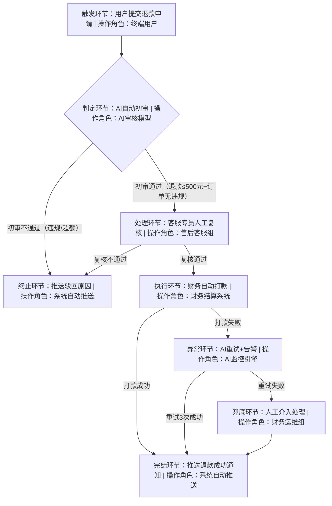

# AI SDD 标准化需求文档模板

# 需求背景

## 1. 需求基础信息

|字段名称|字段说明|填写示例|
|---|---|---|
|需求ID|唯一标识，AI追溯核心，格式：类型-日期-序号（数据:D/流程:P/功能:F）|D-20260321-001|
|需求名称|简洁概括核心目标，无修饰语|用户行为日志数据清洗与宽表构建|
|需求提出人|姓名+部门+联系方式|张三-数据部-138XXXX1234|
|开发类型|固定选择：数据开发/流程开发/功能开发|数据开发|
|优先级|P0(紧急)/P1(高)/P2(中)/P3(低)|P1|
|版本号|初始V1.0，变更迭代升级|V1.0|
|预计上线时间|YYYY-MM-DD|2026-04-10|
|关联AI SDD配置|绑定AI开发环境参数、模型、数据集|AI数据清洗模型V2.0、离线计算集群|
## 2. 需求背景与价值

**填写要求**：说明业务痛点、需求来源、预期业务价值、AI辅助开发的核心作用，避免空泛描述

**通用样例**：当前业务场景下，原有数据处理/流程流转/功能模块存在效率低、误差高、人工成本大的问题，无法支撑业务决策/运营落地。通过本次开发，依托AI SDD环境实现自动化处理，提升效率X%、降低误差Y%，满足业务合规、运营提效、数据精准的核心目标。

## 3. 需求约束与边界

- **技术约束**：AI SDD环境兼容要求、数据权限、算力限制、接口规范

- **业务约束**：合规要求、数据脱敏、流程审批权限、功能使用范围

- **边界说明**：明确需求**包含内容**、**不包含内容**，杜绝需求蔓延

## 4. 验收标准

**填写要求**：AI可自动校验+人工可复核的量化指标，含功能达标、性能指标、准确率、耗时、覆盖率等

## 5. 变更与追溯记录

|版本号|变更时间|变更人|变更内容|AI校验结果|
|---|---|---|---|---|
|V1.0|2026-03-21|张三|需求初稿提交|AI解析通过，无歧义|
---

# 第一部分：数据开发需求

## 1. 数据开发核心定义

针对数据采集、清洗、转换、加工、建模、存储、输出、展示等全流程需求，依托AI SDD实现数据标准化处理，保证数据质量、血缘可追溯、指标口径统一、呈现合规易用。

## 2. 详细需求章节

### 2.1 数据源信息

**填写要求**：按数据库接口、文件接口分类梳理，明确连接方式、权限、字段、更新规则，适配AI自动对接、校验、读取数据，杜绝数据源歧义。

“提供接口文档（文件接口、API接口、数据库接口）”

### 2.2 数据处理逻辑

**填写要求**：按目标输出字段逐一梳理，明确字段溯源、清洗转换/聚合关联规则，无模糊表述，支持AI自动映射生成SQL/ETL代码，实现字段级可追溯、可校验。

|**目标字段名称**|**字段来源**|**处理规则**|
|---|---|---|
|user_id|MySQL业务库 user_behavior_log 表|1. 剔除空值、0值、非字符串格式的无效数据；2. 保留原始字段值，不做加密/脱敏处理；3. 作为关联主键，保证唯一性|
|behavior_type|MySQL业务库 user_behavior_log 表|1. 过滤非枚举值数据，枚举范围：click、view、pay、share；2. 统一转为小写格式；3. 空值标记为unknown|
|create_time|MySQL业务库 user_behavior_log 表|1. 剔除空值、非法时间格式数据；2. 统一转换为 yyyy-MM-dd HH:mm:ss 标准 datetime 格式|
|device_id|MySQL业务库 user_behavior_log 表|1. 空值填充为 default_device；2. 去除特殊字符、空格，保留纯字符串|
|behavior_date|衍生字段（取自 create_time）|1. 截取 create_time 的日期部分（yyyy-MM-dd）；2. 作为分区字段，用于数据分层存储|
|user_name|MySQL业务库 user_info 表|1. 按 user_id 左关联匹配；2. 未匹配到数据填充为 unknown；3. 脱敏特殊符号，保留纯文本|
|user_grade|MySQL业务库 user_info 表|1. 按 user_id 左关联匹配；2. 未匹配到数据填充为普通用户；3. 枚举值标准化：普通用户、VIP、钻石会员|
|behavior_count|聚合计算字段|1. 按 user_id + behavior_date 分组；2. 统计每组行为记录总条数；3. 数值类型，默认值为0|
|behavior_duration|聚合计算字段|1. 按 user_id + behavior_date 分组；2. 累加单条行为时长，单位：秒；3. 空值、负值统一修正为0|
### 2.3 目标数据存储

数据汇总策略：每天6点、每周

数据生命周期：180天

### 2.4 数据质量要求

**样例**：数据完整性≥99.9%，唯一性（user_id+behavior_type+create_time）无重复，准确性：指标误差≤0.1%，脱敏合规：敏感字段加密处理

### 2.5 数据查询与筛选条件

**填写要求**：明确数据查询场景、筛选维度、条件规则、权限限制，支持AI自动生成查询语句、配置筛选界面，保证查询高效合规。

|**查询场景**|**筛选字段**|**筛选规则与限制**|
|---|---|---|
|日常行为数据分析|behavior_date（日期）、user_grade（用户等级）、behavior_type（行为类型）|1. 日期支持单日/区间查询，最大查询跨度90天；2. 用户等级、行为类型支持多选/全选；3. 支持user_id精准模糊查询，模糊查询需加%通配符；4. 普通用户仅可查询本部门数据，管理员可全量查询|
|报表定时抽取|behavior_date（日期）|1. 固定按T-1日自动查询生成前一日数据；2. 无人工筛选权限，系统定时执行；3. 查询结果直接推送至BI报表平台|
|异常数据排查|user_id、behavior_count、create_time|1. 支持behavior_count阈值筛选（大于/小于/等于）；2. create_time精准到小时维度；3. 仅数据运维人员可操作，留存查询日志|
### 2.6 字段展示顺序

**填写要求**：按业务阅读习惯排序输出字段，区分核心展示字段、非核心字段，标注是否隐藏，适配AI自动配置展示列表、导出文件字段顺序。

**标准展示顺序（从左至右）**：

1. behavior_date（核心，必显）

2. user_id（核心，必显）

3. user_name（核心，必显）

4. user_grade（核心，必显）

5. behavior_type（核心，必显）

6. behavior_count（核心，必显）

7. behavior_duration（核心，必显）

8. device_id（非核心，默认隐藏，可手动开启）

9. create_time（非核心，默认隐藏，可手动开启）

### 2.7 数据呈现样式

**填写要求**：明确数据展示载体、格式规范、样式规则、脱敏要求，覆盖页面展示、文件导出、报表呈现三类场景，适配AI自动渲染样式。

#### 2.7.1 页面端呈现样式

- **展示载体**：数据平台可视化列表、BI报表看板

- **布局样式**：固定表头、斑马纹行、支持列宽拖拽、分页展示（每页50条）

- **数值样式**：时间字段右对齐、文本字段左对齐、数值字段保留2位小数；空值显示“-”

- **脱敏规则**：user_name显示姓氏+*（如李**），不展示完整手机号、身份证号

- **交互样式**：支持排序（点击表头升降序）、列隐藏/显示、数据刷新、导出

#### 2.7.2 文件导出呈现样式

- **导出格式**：Excel、CSV（默认Excel，支持切换）

- **文件样式**：表头加粗、字段居中、自动列宽、冻结首行

- **命名规则**：用户行为报表_yyyyMMdd.xlsx

- **字段限制**：仅导出必显字段，脱敏规则同页面端

#### 2.7.3 报表呈现样式

- **展示形式**：表格+趋势图（按日期统计行为总量）

- **聚合规则**：按behavior_date、user_grade分组聚合展示

- **更新频率**：每日9点更新前一日数据，保留历史趋势

### 2.8 数据输出与应用

**样例**：输出宽表供BI报表、用户画像模型调用；支持API接口按需调取；每日9点前完成前一日数据加工

## 3. 数据开发验收标准

- 数据处理耗时：≤2小时（每日凌晨2-4点执行）

- 数据质量校验：AI自动巡检通过率100%

- 字段覆盖率：需求字段100%落地，无缺失

- 数据血缘：AI可追溯全流程链路，可视化展示

- 查询性能：单条件查询≤3秒，组合查询≤10秒

- 呈现合规性：字段顺序、样式、脱敏规则100%匹配需求

---

# 第二部分：流程开发需求

## 1. 流程开发核心定义

针对业务流程编排、节点流转、审批规则、异常处理、自动化执行等需求，依托AI SDD实现流程标准化、节点可配置、异常可自愈、流转可监控。

## 2. 详细需求章节

### 2.1 流程基础信息

**样例**：流程名称：用户退款审批流程，流程类型：自动化审批+人工复核，适用场景：用户线上订单退款，触发方式：订单退款申请提交自动触发

### 2.2 流程节点与流转规则

**填写要求**：按执行顺序列明节点名称、节点类型、执行角色、流转条件、超时规则，AI自动生成流程画布；同步绘制标准流程图，标注节点、分支、异常链路

**标准流程图样例（Mermaid Graph标准语法·AI可识别）**

1. 节点1：AI自动初审（系统节点），规则：校验订单是否已完成、退款金额≤500元、无违规记录；流转条件：通过→节点2，驳回→结束流程并推送用户

2. 节点2：客服专员复核（人工节点），角色：售后客服组，处理时限：2小时；流转条件：通过→节点3，驳回→结束流程并推送用户

3. 节点3：财务自动打款（系统节点），规则：对接支付接口完成退款；流转条件：打款成功→流程完结，打款失败→异常节点

   **提供图片样例**

### 2.3 输入输出表单要求

**填写要求**：明确流程各节点必填/选填字段、字段类型、校验规则、格式规范，支持AI自动生成表单模板、校验字段合法性

**输入表单（退款申请单）样例**：

- **必填字段**：订单编号（字符串，16位纯数字，唯一校验）、用户ID（字符串，关联用户中心）、退款金额（数值，保留2位小数，≤5000元）、退款原因（枚举值：商品质量问题/不想买了/拍错商品/其他）、退款账户（字符串，银行卡/支付宝/微信，脱敏展示）

- **选填字段**：问题描述（文本，≤200字）、凭证上传（图片，≤5M，支持jpg/png）

- **AI校验规则**：订单编号查重、退款金额与订单实付金额一致性校验、敏感词过滤

**输出表单（审批/回执单）样例**：

- 初审回执单：订单编号、初审结果、驳回原因（若有）、AI审核时间、下一步节点

- 审批单：订单信息、用户信息、退款信息、复核意见、审批人、处理时间

- 退款回执单：订单编号、退款金额、到账账户、打款时间、预计到账时间、状态

- 输出格式：支持PDF下载、站内信推送、短信通知，字段脱敏展示敏感信息

### 2.6 权限与配置

**样例**：流程配置权限：管理员专属；节点操作权限：按角色分级；流程参数支持AI可视化配置修改

## 3. 流程开发验收标准

- 流程触发准确率：100%

- 节点流转正确率：100%，无错流、漏流

- 异常处理成功率≥99.5%

- AI流程可视化：节点、链路、状态可实时查看

- 平均处理时长：≤3小时

---

# 第三部分：功能开发需求

## 1. 功能开发核心定义

针对系统功能模块、交互逻辑、接口服务、页面展示、用户操作等需求，依托AI SDD实现功能标准化开发、代码自动生成、测试用例自动匹配。

## 2. 详细需求章节

### 2.1 功能概述与用户角色

**样例**：功能名称：用户数据导出功能，适用角色：运营人员、管理员，功能目标：支持按条件筛选用户数据，导出Excel/CSV文件，满足运营数据分析需求

### 2.2 功能交互逻辑

**填写要求**：描述操作步骤、输入输出、交互效果、校验规则，支持AI生成原型与代码

**样例**：

1. 操作入口：运营后台-用户管理-数据导出

2. 输入条件：用户注册日期区间、用户等级、用户状态，支持多选、模糊查询

3. 校验规则：注册日期起止间隔≤90天，超出则AI提示报错；单次导出数据量≤10万条

4. 输出结果：生成Excel文件，包含user_id、user_name、register_time、user_grade字段，支持下载、重发

### 2.4 页面与展示要求

**样例**：页面布局：筛选栏+导出按钮+历史记录列表；展示效果：导出进度实时显示，历史记录保留7天，支持排序、筛选；UI风格贴合系统现有主题

**提供图片样例**

### 2.5 安全与性能要求

**样例**：权限校验：仅授权角色可操作，日志记录操作人、时间、筛选条件；性能要求：导出生成时间≤30秒，并发支持≤5人同时操作

## 3. 功能开发验收标准

- 功能操作覆盖率：100%，所有交互逻辑正常

- 接口调用成功率≥99.9%，无报错

- 性能达标：导出耗时、并发符合要求

- 安全校验：越权操作拦截率100%

- AI自动测试用例通过率：100%
